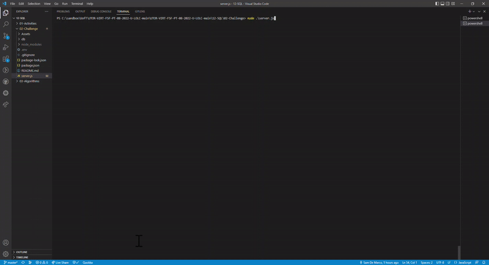

# 12 SQL: Employee Tracker

  <br />
  
   Here is a GIF of Note Taker application working:
    <br />


  ## Description

This is a **content management systems (CMS)** command-line application used to manage a company's employee database, using Node.js, Inquirer, and MySQL.

  ## Challenges

Definitely a little tricky to figure out how to work with inquirer prompts relying on data queried from a SQL database!

## User Story

```md
AS A business owner
I WANT to be able to view and manage the departments, roles, and employees in my company
SO THAT I can organize and plan my business
```

## Acceptance Criteria

```md
GIVEN a command-line application that accepts user input
WHEN I start the application
THEN I am presented with the following options: view all departments, view all roles, view all employees, add a department, add a role, add an employee, and update an employee role
WHEN I choose to view all departments
THEN I am presented with a formatted table showing department names and department ids
WHEN I choose to view all roles
THEN I am presented with the job title, role id, the department that role belongs to, and the salary for that role
WHEN I choose to view all employees
THEN I am presented with a formatted table showing employee data, including employee ids, first names, last names, job titles, departments, salaries, and managers that the employees report to
WHEN I choose to add a department
THEN I am prompted to enter the name of the department and that department is added to the database
WHEN I choose to add a role
THEN I am prompted to enter the name, salary, and department for the role and that role is added to the database
WHEN I choose to add an employee
THEN I am prompted to enter the employee’s first name, last name, role, and manager, and that employee is added to the database
WHEN I choose to update an employee role
THEN I am prompted to select an employee to update and their new role and this information is updated in the database 
```
 
  ## Table of Contents
  - [Description](#description)
  - [Installation](#installation)
  - [Usage](#usage)
  - [License](#license)
  - [Contributors](#contributors)
  - [Tests](#tests)
  - [Questions](#questions)
  ## Installation
   The applications requires npm installs with 'inquirer', 'chalk', 'express', 'console.table', and 'dotenv' packages. Application is then delpoyed via Terminal with  
   Node command.
  ## Usage
   Manage an employee database where you can add new employees, new roles, and departments which can also be viewed in table format. You can also update an employee role along with being able to delete a role, department, and employee.
  ## License
  
  <br />
  MIT License URL:   https://opensource.org/licenses/MIT. 
  ## Contributors
   Sam De Marco
  ## Tests
  N/A 
  ## Questions
   Email<br />
  <br />
  My GitHub: [Samdemarco](https://github.com/Samdemarco)

  Contact me via email for any issues: sam.demarco@gmail.com<br /><br />


